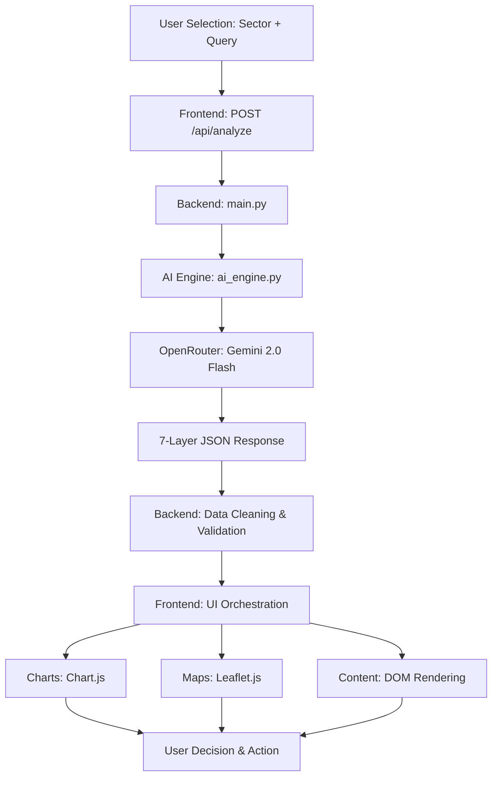

<<<<<<< HEAD
# 🌌 ULAS: Universal Life Action System

**ULAS** is a high-performance, multi-sector intelligence engine designed to bridge the gap between complex information and real-world action. By deploying a proprietary **7-Layer Intelligence Pipeline**, ULAS provides structured, actionable insights across Government, Education, Jobs, Finance, Healthcare, Legal, and Daily Utility sectors.

---

## 🚀 Core Features

### 🧠 1. The 7-Layer Intelligence Engine
Every query processed by ULAS passes through seven distinct layers of analysis:
- **Intent Detection**: Classifies the problem type with high precision.
- **Knowledge Layer**: Explains the core concept simply.
- **Decision Engine**: Recommends the most efficient path forward.
- **Cost Intelligence**: Provides cost estimations and comparisons.
- **Time Engine**: Predicts timeframes and identifies potential delays.
- **Execution Engine**: Generates a step-by-step workflow for action.
- **Resource Mapping**: Links to official portals, apps, and documents.

### 📊 2. Intelligence Visualization
Integrated **Chart.js** visuals provide dynamic cost-vs-time benchmarking, allowing users to make data-driven decisions at a glance.

### 📍 3. Real-World Service Mapping
Using **Leaflet.js**, ULAS identifies nearby service providers (like plumbers, doctors, or government offices) and presents rich profiles including **contact details, ratings, and estimated fees**.

### 🔐 4. Secure Authentication
A premium Login/Register system ensures user data is protected and allows for personalized action tracking.

---

## 🛠️ Technology Stack

| Layer | Technology |
| :--- | :--- |
| **Frontend** | HTML5, CSS3 (Vanilla), JavaScript (ES6+), Lucide Icons |
| **Backend** | Python, FastAPI, Uvicorn |
| **AI Intelligence** | Gemini 2.0 Flash (via OpenRouter API) |
| **Mapping** | Leaflet.js (OpenStreetMap) |
| **Visualization** | Chart.js |
| **Security** | Dotenv (Environment variable protection) |

---

## 📂 Project Structure

```text
d:/hack1/
├── backend/
│   ├── main.py          # FastAPI application & entry point
│   ├── ai_engine.py      # Core 7-layer pipeline logic
│   ├── .env              # Secure API keys (ignored by git)
│   └── requirements.txt  # Backend dependencies
├── frontend/
│   ├── index.html       # Single Page Application structure
│   ├── styles.css       # Premium design system
│   └── app.js           # Dynamic UI & API integration logic
└── .gitignore            # Version control safety rules
```

---

## ⚡ Step-by-Step Installation

### 1. Clone the Repository
```bash
git clone <your-repo-url>
cd hack1
```

### 2. Set Up the Backend
1. Navigate to the backend folder.
2. Install dependencies:
   ```bash
   python -m pip install -r backend/requirements.txt
   ```
3. Create a `.env` file in the `backend/` directory and add your key:
   ```text
   OPENROUTER_API_KEY=your_key_here
   ```

### 3. Launch the System
Start the FastAPI server:
```bash
python backend/main.py
```
The application will be live at: **[http://localhost:8000](http://localhost:8000)**

---

## 🛠️ Step-by-Step Workflow

1.  **User Input**: User selects a sector (e.g., "Utility") and enters a query (e.g., "Electrician nearby in Chittoor").
2.  **API Routing**: The frontend sends a POST request to the `/api/analyze` endpoint.
3.  **Intelligence Pipeline**: `ULASEngine` cleans the request and prompts the AI for a structured 7-layer JSON response.
4.  **Data Processing**: The backend handles character encoding (Rupee symbol support) and format validation.
5.  **UI Rendering**:
    *   **Text Layers**: Populated via DOM manipulation.
    *   **Charts**: Rendered using Chart.js based on numerical AI data.
    *   **Maps**: Markers are placed using randomized offsets near the user's location with detailed service profiles.
6.  **User Action**: The user follows the generated execution steps and contacts the suggested service providers directly.

### 🔄 System Workflow Diagram



---

## 🛡️ Security Note
All API keys are managed through environment variables. **Never** push your `.env` file to public repositories.

---

## 📜 License
This project is licensed under the **MIT License**. See the [LICENSE](LICENSE) file for details.

---

**Developed for the Hackathon by [Hemadri Kaligiri](https://github.com/hemadrikaligiri4-source) 🚀**
